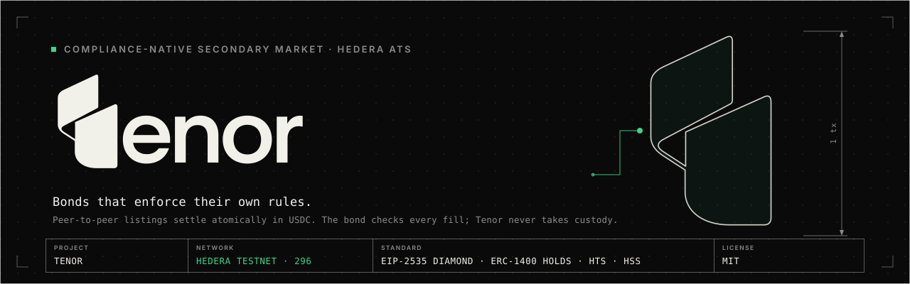
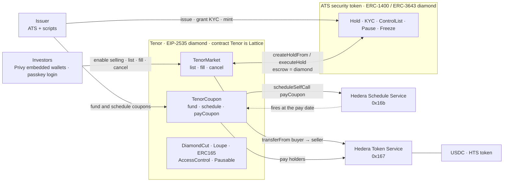
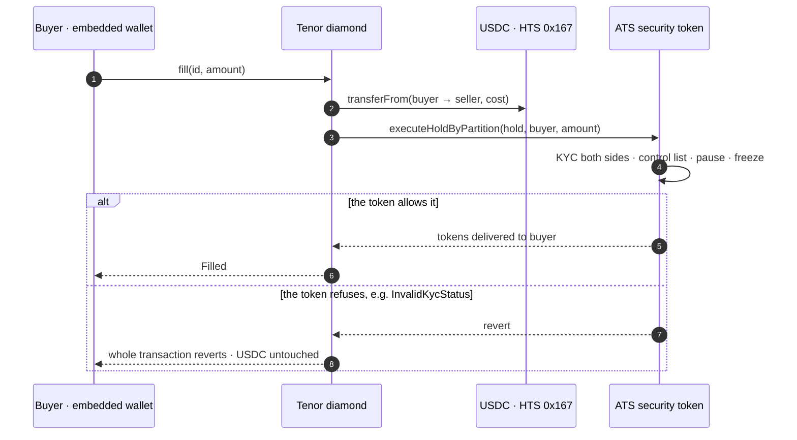

<p align="center">
  
</p>

# Tenor

[](https://github.com/dadadave80/tenor/actions/workflows/ci.yml)
[](https://deepwiki.com/dadadave80/tenor)
[](LICENSE)
[](contracts/foundry.toml)
[](https://getfoundry.sh)
[](#deployed-addresses-hedera-testnet-chain-296)
[](https://tenor-markets.vercel.app)
[](https://ethglobal.com/events/ethonline2026)

**A compliance-native secondary market for Hedera ATS security tokens.**

Compliant bonds can already be *issued* on Hedera's Asset Tokenization Studio. They cannot easily be
*traded*, because every transfer has to keep obeying the issuer's rules — KYC on both sides, block
lists, freezes, a global pause. Tenor is the missing venue: peer-to-peer listings that settle
atomically against USDC, where the security token itself enforces compliance on every fill.

Built for **ETHOnline 2026** · Track: Start Fresh · Hedera (Tokenization of Anything) · Privy (Best
financial flow)

---

## What makes it different

**No custody.** A listing does not move the seller's tokens into an escrow contract. It places an
**ATS hold** over part of their balance with the Tenor diamond as the hold's *escrow*. The tokens
stay in the seller's wallet, visibly reserved, until a buyer fills. So:

- the market never holds a security token — `TenorMarket`'s diamond balance is provably always zero
- the diamond needs no KYC status of its own, because it is never a holder
- the seller's own ERC-20 approval to the diamond is their self-imposed selling cap

**Compliance by construction, not by copy.** Tenor contains no compliance logic. A fill calls
`executeHoldByPartition` on the token, and the token checks KYC on both parties, the control list and
the pause state. An unverified buyer's fill reverts — and because the USDC leg is in the same
transaction, their money is untouched. Tenor cannot get compliance wrong because Tenor does not
implement it.

**One transaction per action.** Enable selling once (a single `approve`), then each listing is one
transaction that creates the hold and records the listing together — a listing can never exist
without its hold, and vice versa.

**Coupons are booked on-chain and anyone can settle them.** The issuer funds a coupon once and books
it with the **Hedera Schedule Service** (HIP-1215), and the network fires the booked call at the
second it was booked for. `payCoupon` is permissionless and idempotent, so the payment never depends
on that call's sender: any holder or keeper completes it, and a holder who never associated with USDC
is recorded as skipped rather than stranding everyone else's coupon. What the scheduled call does and
does not do today is written up in [`docs/GROUND-TRUTH.md`](docs/GROUND-TRUTH.md) §10.

---

## Architecture



One transaction per fill. USDC moves first, then the token executes the hold, and the token, not
Tenor, decides whether the transfer is allowed:



The on-chain component is a single **EIP-2535 diamond composed from [Lattice](https://github.com/dadadave80/lattice)
modules**, including new reusable facets for the Hedera Token Service and Hedera Schedule Service.

---

## Deployed addresses (Hedera testnet, chain 296)

Every contract is **verified on Sourcify, `exact_match`**: the 14 this deploy created — the `Tenor`
diamond, its ten facets and three initializers — and all 121 contracts of the ATS system. The retired
first deployment's 16 contracts are verified too. `bun run verify:tenor` and `bun run verify:ats`
re-check and print each verdict.

| Contract | Address | HashScan |
|---|---|---|
| **Tenor diamond** (market + coupons) | `0xD81B627A11ED35110fAE3B0EdbBe475CA6454457` | [open](https://hashscan.io/testnet/contract/0xD81B627A11ED35110fAE3B0EdbBe475CA6454457) |
| **Tenor Green Note 2027 (TGN27)** | `0x1EB9D5370382dAF0A0A116C0b7C77899799d5EAF` | [open](https://hashscan.io/testnet/contract/0x1EB9D5370382dAF0A0A116C0b7C77899799d5EAF) |
| **Demo USDC** (HTS, 6 dp) | `0.0.10504590` · `0x…a0498e` | [open](https://hashscan.io/testnet/token/0.0.10504590) |
| ATS BusinessLogicResolver | `0x0aFFA521E6019AAfc4A61829c1B823375E1Bf040` | [open](https://hashscan.io/testnet/contract/0x0aFFA521E6019AAfc4A61829c1B823375E1Bf040) |
| ATS Factory | `0x6b48Ac8a6fb42b82Bc1e2d615503e9274Db8bA05` | [open](https://hashscan.io/testnet/contract/0x6b48Ac8a6fb42b82Bc1e2d615503e9274Db8bA05) |
| Issuer / operator | `0xc46A896cBf32Ba3212ebE12108345F30AC0a0Efd` | [open](https://hashscan.io/testnet/account/0xc46A896cBf32Ba3212ebE12108345F30AC0a0Efd) |

Facet addresses are enumerable on-chain via `DiamondLoupe.facets()` and are listed in the client's
**Contracts** page.

### Evidence on chain

| Claim | Transaction |
|---|---|
| **G1 — atomic delivery-versus-payment.** 25 TGN27 against 2,450 USDC, buyer ≠ seller, both legs in one transaction with the bond checking compliance | [`0x9553256d…`](https://hashscan.io/testnet/transaction/0x9553256de24f6be3ac9f4db343b7b0d6be0b4293acbd20b17666f48d3201ba20) |
| A compliant transfer is allowed | [`0x638e0e51…`](https://hashscan.io/testnet/transaction/0x638e0e517920f2c5b1e3403f8761269d6a4763800f923f553c7f0bba0db8f94a) |
| The same transfer to an unverified holder is refused **by the token**, `InvalidKycStatus()` `0xfc855b1b` | selector asserted, not just "it reverted" |
| A coupon paid — 1,462.50 USDC across 2 holders, triggered by a **non-issuer** | [`0x0a377c80…`](https://hashscan.io/testnet/transaction/0x0a377c8025481788e9c2acf83c4edec56fa2b35bbd5ae2ad2798c44a90f56791) |
| A freshly generated wallet — what a passkey sign-in produces — funded and buying | [`0x1819d48c…`](https://hashscan.io/testnet/transaction/0x1819d48c1c3515fa8e6a54c25bcdc70a8f9c129a42ba23d8c8f14d37bb4c4f94) |

`bun run integration` reproduces the market evidence; `bun run coupon` reproduces the coupon.

## Hedera track checklist

| Extra point | Status | Where to look |
|---|---|---|
| Secondary market for ATS-issued assets | Done | Every listing and fill trades the ATS bond TGN27; the atomic delivery-versus-payment fill is [`0x9553256d…`](https://hashscan.io/testnet/transaction/0x9553256de24f6be3ac9f4db343b7b0d6be0b4293acbd20b17666f48d3201ba20) |
| Compliance controls in use (KYC grants, freezes, transfer restrictions, pauses) | Done | [Compliance controls actually exercised](#compliance-controls-actually-exercised) — and the token, not Tenor, is what refuses: `InvalidKycStatus()` `0xfc855b1b`, with the buyer's USDC untouched |
| Custom fee schedules and coupon distributions | Done | `setFeeBps`, capped at the 100 bp ceiling, in [`contracts/src/interfaces/ITenorMarket.sol`](contracts/src/interfaces/ITenorMarket.sol); 1,462.50 USDC paid across 2 holders in [`0x0a377c80…`](https://hashscan.io/testnet/transaction/0x0a377c8025481788e9c2acf83c4edec56fa2b35bbd5ae2ad2798c44a90f56791) |
| Oracle integration for asset pricing or NAV | Done | Chainlink USDC/USD data feed on Hedera testnet, read by the client to express settlement values in USD and to warn when the settlement token leaves its peg. Feed: [`0xb632a7e7e02d76c0Ce99d9C62c7a2d1B5F92B6B5`](https://hashscan.io/testnet/contract/0xb632a7e7e02d76c0Ce99d9C62c7a2d1B5F92B6B5). |
| Scheduled Transactions for coupon payments | Partial | The schedule is booked and fires within 25 ms of its pay date; the scheduled call itself fails `INVALID_PAYER_SIGNATURE`, so a permissionless `payCoupon` completes settlement — [`docs/GROUND-TRUTH.md`](docs/GROUND-TRUTH.md) §10 |
| Contributions back upstream to ATS | Done | Two issues filed during the event: [hiero-ledger/hiero-consensus-node#27263](https://github.com/hiero-ledger/hiero-consensus-node/issues/27263) (HIP-1215 contract-as-payer finding) and [hashgraph/asset-tokenization-studio#1405](https://github.com/hashgraph/asset-tokenization-studio/issues/1405) (Sourcify verification of the whole ATS system, Foundry deploy path). |

**Why Tenor pays coupons itself.** ATS's own `Coupon` facet records a coupon as a corporate action —
record date, execution date, accrual window, rate — and binds a holder snapshot to it, so a holder's
entitlement can be read back as a `numerator`/`denominator` fraction. It moves no settlement asset:
there is no payment leg in it. `TenorCoupon` is that payment leg. The issuer funds it in USDC, books
it for a second with the Hedera Schedule Service, and `payCoupon` pays each registered holder pro rata
to their balance through the Hedera Token Service. Tenor keeps its own holder register and does not
read ATS's coupon record today; the two are complementary, not wired together.

One thing is deliberately **not** claimed: coupons do not yet pay with nobody sending a transaction.
The schedule is booked with the Hedera Schedule Service and the network fires it within 25 ms of its
pay date, but the scheduled call itself fails `INVALID_PAYER_SIGNATURE`, so the transfer is completed
by a permissionless `payCoupon` that any holder can call. `docs/GROUND-TRUTH.md` §10 has the evidence
and the cause, and the app's copy says exactly this and no more.

---

## How the pieces fit

| Component | Role |
|---|---|
| `contracts/src/market/` | `TenorMarket` — listings, fills, cancels. Hold-based DVP. |
| `contracts/src/coupon/` | `TenorCoupon` — funding, HSS scheduling, permissionless idempotent settlement. |
| `contracts/src/TenorHTS.sol` | The two `0x167` calls the permissionless paths make. |
| `contracts/src/TenorInit.sol` | One-shot initializer: roles, module storage, ERC-165 ids. |
| `contracts/script/DeployTenor.s.sol` | The diamond recipe, shared by production and tests. |
| `scripts/` | ATS system deploy, USDC creation, bond issuance, M1 evidence, integration run. |
| `apps/web/` | Next.js client: passkey login, Privy embedded wallets, simulate-before-sign UX. |

---

## Issuers

One Tenor market serves one instrument. The security token and the settlement token are pinned at
initialisation — `TenorInit.init` stores both — and `list` reverts `TokenNotListable` for any other
token, because a venue that took the token from calldata could be made to pay a seller for a hold
that does not exist. Roles are pinned in the same call: `ISSUER_ROLE` (fund a coupon, register
holders, cancel) and `HSS_SCHEDULER_ROLE` go to one issuer address, `DEFAULT_ADMIN_ROLE` (pause,
`setFeeBps`, `setMaxDuration`) to the admin. The client is pinned the same way: it reads one market,
from `NEXT_PUBLIC_TENOR_DIAMOND`.

So a second issuer onboards by repeating those steps for themselves: issue their bond with ATS,
deploy their own Tenor market — `DeployTenor.run(admin, issuer, usdc, token, feeBps, maxDuration)` in
[`contracts/script/DeployTenor.s.sol`](contracts/script/DeployTenor.s.sol), driven by
`bun run deploy:tenor`, which passes the broadcasting key as both admin and issuer — and point a
client at the new diamond. Nothing is shared between two markets, so nothing has to be trusted
between two issuers.

Issuer operations run from the command line today: `bun run issuer` wraps the ATS calls an issuer
actually makes — `kyc grant`/`kyc revoke`, `freeze`/`unfreeze`, `pause`/`unpause`,
`control-list add`/`control-list remove`, and `status`.

An in-app issuer console, and a client that can hold more than one market, are the next steps.
Neither exists today.

---

## Running it

```bash
git clone --recursive <this repo>       # --recursive matters, see below
cd tenor
bun install
```

> **Submodules are recursive.** Lattice vendors `diamond-lib` and `forge-std` as its own submodules,
> and `git submodule add` does not recurse. A non-recursive clone leaves them as empty directories and
> nothing resolves. If you already cloned flat:
> `git submodule update --init --recursive`.

Contracts:

```bash
cd contracts
forge build
forge test
```

Testnet (needs a funded Hedera testnet ECDSA key in `contracts/.env`):

```bash
bun run deploy:ats      # ATS system: BusinessLogicResolver, facets, Factory
bun run create:usdc     # the HTS settlement token
bun run issue:bond      # Tenor Green Note 2027, configured for third-party holds
bun run grant:kyc       # KYC to A and B, mint, and the two transfer proofs
```

Get a key by creating a testnet account at [portal.hedera.com](https://portal.hedera.com) — choose
**ECDSA** — and putting it in `contracts/.env`. The portal issues its own keyed account; it does not
send HBAR to an address you supply.

---

## Hedera services used

| Service | Where |
|---|---|
| **Asset Tokenization Studio** | The bond is issued through the ATS Factory and enforces KYC, control lists, freeze and pause on every fill. Holds provide the delivery side of DVP. |
| **Hedera Token Service** (`0x167`) | USDC settlement — `transferFrom` on the HIP-906 allowance path — plus `associateToken` and the fee sweep. |
| **Hedera Schedule Service** (`0x16b`) | HIP-1215 `scheduleCall`/`scheduleSelfCall` books coupon payments; the network executes them at expiry. |
| **Scheduled Transactions** | Each coupon is booked for a fixed second and the network fires it on time; the payment itself is completed by a permissionless call — [`docs/GROUND-TRUTH.md`](docs/GROUND-TRUTH.md) §10. |

### Compliance controls actually exercised

- KYC granted to investors A and B, withheld from C — C's fill fails simulation and is never offered
- a transfer to an unverified holder is refused **by the token**, with the buyer's USDC untouched
- the issuer freezes a holder (`bun run issuer freeze`, ERC-3643 `setAddressFrozen`, which on this token
  writes the control list) and their button flips to "Account blocked" without a reload
- the issuer pauses the token and the market shows "Trading paused by issuer"

---

## Privy

Investors sign in with a **passkey** — no seed phrase, no extension, no HBAR in hand — and Privy
creates an embedded wallet silently. From there the app drips test HBAR and demo USDC so a brand-new
user reaches their first trade without leaving the page.

The financial flow signed by the embedded wallet is the **fill**: a single transaction that moves USDC
from buyer to seller and the bond from seller to buyer under the issuer's rules. Before it is offered,
the client simulates the exact transaction as the connected wallet, so **no user is ever asked to sign
a transaction that will fail** — the primary button's label *is* the blocking condition
(`Enter an amount` → `Insufficient USDC balance` → `Approve USDC` → `Buy`, or
`Verification required` when the issuer has not verified them yet).

---

## Documentation

| Document | Contents |
|---|---|
| [`docs/SPEC.md`](docs/SPEC.md) | Engineering specification, with the forced deviations marked inline. |
| [`docs/GROUND-TRUTH.md`](docs/GROUND-TRUTH.md) | Every external API read from source rather than memory. Start here. |
| [`docs/DESIGN.md`](docs/DESIGN.md) | UX flows, screens, components, copy. |
| [`docs/DEMO.md`](docs/DEMO.md) | Addresses, on-chain evidence, the click-through, and what is deliberately not claimed. |

`GROUND-TRUTH.md` is the document to read first. §9 is the local rehearsal — how the whole deploy
chain was run against a local node before it was run for money, which found six real breaks; §10 is
the one gate that does not fully pass, recorded in full because the product makes a claim about it.

`GROUND-TRUTH.md` exists because the original spec's account of the Lattice HTS/HSS surface was
written from memory and turned out to be wrong in ways that did not compile — wrong function names,
wrong argument order, and, most consequentially, no mention that every mutating helper is
access-controlled on `msg.sender`. Since a facet's `delegatecall` frame preserves `msg.sender` as the
original caller, routing the permissionless `fill()` through them would have required the *buyer* to
hold an operator role. The document records what the code actually does, and the seven deviations that
follow from it.

---

## Pre-existing work

- **[Lattice](https://github.com/dadadave80/lattice)** (MIT, by the same author) is a pre-existing
  EIP-2535 module library, consumed here as a pinned Forge submodule. Tenor adds no code to it.
- Lattice's **Hedera HTS/HSS modules** (branch `feat/hedera-system-contract-modules`) were authored
  during the event. The submodule is pinned at `7c8450b`; that branch is still under active
  development, which is exactly why the pin exists.
- **[Asset Tokenization Studio](https://github.com/hashgraph/asset-tokenization-studio)** (Apache-2.0)
  is Hedera's public tokenization kit, consumed as `@hashgraph/asset-tokenization-contracts@8.0.0`.

All Tenor code in this repository was authored after 4 Sep 2026.

---

## AI tools

Built with **Claude Code** (Claude Opus). It produced the contracts, tests, scripts and client under
direction, and — more usefully — was used to *verify assumptions against source* rather than trust the
specification: reading Lattice's and ATS's actual Solidity, and checking every npm export at runtime.
That caught the access-control problem described above, plus two wrong symbol names and a struct
argument that the type checker alone would not have surfaced before testnet.

Design explored in **Claude Design**. The Tenor logo — ribbon mark and wordmark — was designed with
**Codex** (ChatGPT 5.6 Astra). The specification, ground-truth notes and all planning documents are
committed under `docs/`.

---

## License

MIT, see [LICENSE](LICENSE).

Contributions: [CONTRIBUTING.md](CONTRIBUTING.md) · Security reports: [SECURITY.md](SECURITY.md) ·
Community: [CODE_OF_CONDUCT.md](CODE_OF_CONDUCT.md)
